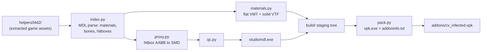

: # Left 4 Dead 2 Infected CV Override Mod

## What the environment already gives us

Verified during research:

- **Full toolchain present**: `bin/studiomdl.exe`, `bin/vpk.exe`, `bin/vtex.exe`, `bin/vtf2tga.exe`, `bin/hlmv.exe`, plus `C:\Program Files\VPKEdit\vpkeditcli.exe` and Python 3.13 with numpy/Pillow.
- **Assets already extracted** to `helpers/l4d2/`: 143 renderable infected models and 579 VMTs under `materials/models/infected/`.
- **MDL v49 parses cleanly in pure Python** — no Crowbar/Blender needed. I read bones (name/parent/pos/quat), per-bone hitbox AABBs with hit-group IDs, attachments, `cdmaterials`, and texture names directly out of `hunter.mdl`, `hulk.mdl`, `witch.mdl`.
- **Every infected model delegates all animation** to a shared anim model via `$includemodel` (`hunter.mdl` → `models/infected/anim_hunter.mdl`; common infected → `anim_common.mdl` + `anim_common_vomit.mdl` + `anim_common_male_exp.mdl`). This is the key fact that makes proxy meshes viable: reuse the original skeleton and all animation comes for free.
- **Material graph**: 540 of 579 VMTs are `patch` files including `common/common_infected_shared.vmt` or `common/l4d2/ci_*_include.vmt`. Only 4 materials need special handling (`boomer_hair`, `smoker/boomer_hair`, `witch_hair` are `$alphatest`; `cim_ceda_faceplate` is `$additive`).

## Decisions locked in

- Staged delivery: material-only first, proxy meshes second.
- X-ray visibility (`$ignorez 1`).
- Per-class flat colors.

## Pipeline architecture



Layout under `helpers/`:

- `main.py` — CLI: `index` / `materials` / `models` / `pack` / `deploy` / `verify`, with `--only <model>` and `--force`.
- `cvmod/config.py` — class color table, render flags, tool paths.
- `cvmod/mdl.py` — MDL v49 reader (already prototyped and working).
- `cvmod/vmt.py` — VMT parser with recursive `patch`/`include` resolution, plus writer.
- `cvmod/vtf.py` — minimal VTF writer for solid-color textures.
- `cvmod/index.py` — walks all 143 models, resolves `cdmaterials` + texture names to real VMT paths, emits `index.json` mapping each material to an infected class.
- `cvmod/materials.py`, `cvmod/smd.py`, `cvmod/proxy.py`, `cvmod/qc.py`, `cvmod/compile.py`, `cvmod/pack.py`, `cvmod/manifest.py`.
- `build/` staging tree, `dist/` output VPK. Existing `helpers/l4d2/` stays read-only input.

`manifest.py` content-hashes every input and generated output so reruns only rebuild what changed — this is the "batch tweak" loop: edit the color table or a render flag, rerun `python main.py materials pack deploy`, and only affected files regenerate.

## Phase 0 — Index

Rather than mapping materials by directory name (unsafe: `hulk.mdl` lists `models\infected\common\` in its `cdmaterials`, and `smoker/boomer_hair.vmt` is misleadingly named), derive the mapping **from the model side**: for each MDL, cross `cdmaterials` with texture names to resolve the actual VMT files it uses, then tag each VMT with the owning class. Resolve conflicts with explicit precedence (boss classes beat `common`). Write `index.json` and a human-readable report so unmapped or multiply-claimed materials are visible before anything is generated.

## Phase 1 — Material override (shippable on its own)

For each indexed VMT, emit an override at the same relative path:

```
UnlitGeneric
{
    $basetexture "cvmod/flat_hunter"
    $ignorez     1
    $nocull      1
    $nofog       1
    $vertexcolor 0
    $nodecal     1
}
```

Bake the color into a small solid-color VTF per class rather than using `$color2`, so the framebuffer RGB is exact and mask extraction is an exact-match test. The 4 special materials keep their original `$basetexture` plus `$alphatest 1` / `$additive 1` and get tinted with `$color2` so hair cutouts don't become solid quads.

Starting color table (saturated, mutually separable, and far from L4D2's brown/grey palette):

- common `255,0,255` · boomer `0,255,0` · hunter `0,255,255` · smoker `255,128,0` · charger `255,0,0` · jockey `255,255,0` · spitter `0,255,128` · tank/hulk `0,0,255` · witch `255,255,255` · gibs/limbs `128,0,255`

Also ship `cfg/cv_capture.cfg` disabling bloom, HDR, film grain, DoF and color correction. Source still gamma/tonemaps even unlit materials, so this keeps sampled pixel values close to authored values.

## Phase 2 — Proxy meshes from hitboxes

Prototype on `hunter.mdl` **first**, validate in `hlmv.exe`, then batch.

For each model, read bones and the hitbox set from the MDL, emit a reference SMD containing the original skeleton (names, parents, rest-pose pos/rot) plus one box per hitbox — each box's 8 corners placed at the hitbox AABB in that bone's local space, every vertex weighted 100% to its bone. Optionally inflate by a configurable margin. Then generate a QC:

```
$modelname      "infected/hunter.mdl"
$body proxy     "hunter_proxy.smd"
$cdmaterials    "models/cvmod/"
$surfaceprop    "flesh"
$eyeposition    0 0 73
$illumposition  -1.1 -0.1 36.2
$hboxset "L4D"      // $hbox lines copied verbatim from the MDL
$attachment ...     // copied verbatim
$sequence idle "hunter_proxy.smd"
$includemodel "models/infected/anim_hunter.mdl"
```

Because the skeleton is copied verbatim, `$includemodel` resolves and every animation plays. Copying `$hbox` verbatim preserves shooting and damage behavior.

Known risks to resolve during the prototype, not before:
- **Physics**: the original `.phy` references bones by index. Since the bone list is identical, shipping the original `.phy` unchanged next to the new `.mdl`/`.vvd`/`.vtx` should work, but studiomdl writes a checksum into the MDL that may reject it. Fallback is `$collisionjoints` generated from the same boxes.
- `studiomdl` needs `-game "<root>\left4dead2"`; compile into a scratch dir and move outputs into `build/`.
- Header flags differ between bosses (`65540`) and common infected (`4`); confirm parity in HLMV.
- Any model whose proxy fails to compile falls back to keeping the original mesh with phase 1 materials, so a partial phase 2 is still a working mod.

## Phase 3 — Package and deploy

`vpk.exe` (or `vpkeditcli.exe`) packs `build/` into `dist/cv_infected.vpk` with an `addoninfo.txt` so it appears in Extras → Add-ons, then copies it to `left4dead2/addons/`. For fast iteration, also support deploying `build/` as an unpacked `addons/cv_infected/` folder to skip the repack step. `verify` launches `hlmv.exe` on a chosen model for visual inspection without starting the game.

Survivors, weapons and world geometry are deliberately untouched so the infected are the only recolored thing in frame.